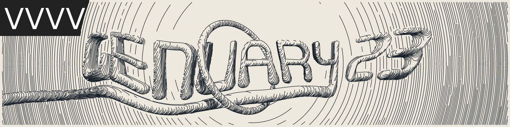

# GENUARY2023
VVVVGAMMA www.visualprogramming.net and GENUARY www.genuary.art is an artificially generated month of time where we build code that makes beautiful things.
\#nodevember #nodevemer2022 #madewithvvvv

Notebook which was used to build up the [VVVVGAMMA](https://www.visualprogramming.net/) patches

ThinkPad X1 Extreme Gen2 version2019
NVIDIA GeForce GTX 1650 Mobile
Intel i7-9750H / 32 GB RAM

**01_PerfectLoop**

01_PerfectLoop.vl was saved with [VVVVGAMMA](https://www.visualprogramming.net/) PREVIEW 2022.5.0-0441

Dependencies/VL.Nugets:
VL.Skia/2022.5.0-0441
VL.Stride/2022.5.0-0441
[VL.ScreenRecorder/0.1.4-alpha](https://www.nuget.org/packages/VL.ScreenRecorder)

**02_MadeIn10min**

02_MadeIn10min.vl was saved with [VVVVGAMMA](https://www.visualprogramming.net/) PREVIEW 2022.5.0-0441

Dependencies/VL.Nugets:
VL.Skia/2022.5.0-0441[VL.ScreenRecorder/0.1.4-alpha](https://www.nuget.org/packages/VL.ScreenRecorder)

**03_GlitchArt**

03_GlitchArt was saved with [VVVVGAMMA](https://www.visualprogramming.net/) PREVIEW 2022.5.0-0441

Dependencies/VL.Nugets:
shaders/DVBTGlitch_TextureFX.sdsl
VL.Skia/2022.5.0-0441
VL.Stride/2022.5.0-0441
[VL.ScreenRecorder/0.1.4-alpha](https://www.nuget.org/packages/VL.ScreenRecorder)

**04_Intersections**

04_Intersections was saved with [VVVVGAMMA](https://www.visualprogramming.net/) PREVIEW 2022.5.0-0441

Dependencies/VL.Nugets:
VL.Skia/2022.5.0-0441
VL.Stride/2022.5.0-0441
[VL.ScreenRecorder/0.1.4-alpha](https://www.nuget.org/packages/VL.ScreenRecorder)  
[VL.PolyTools/1.0.9](https://www.nuget.org/packages/VL.PolyTools)

**05_DebugView**

05_DebugView was saved with [VVVVGAMMA](https://www.visualprogramming.net/) PREVIEW 2022.5.0-0441

Dependencies/VL.Nugets:
VL.Skia/2022.5.0-0441
VL.Stride/2022.5.0-0441
[VL.ScreenRecorder/0.1.4-alpha](https://www.nuget.org/packages/VL.ScreenRecorder)

**06_StealLikeAnArtist**

06_StealLikeAnArtist was saved with [VVVVGAMMA](https://www.visualprogramming.net/) PREVIEW 2022.5.0-0441

Dependencies/VL.Nugets:
VL.Skia/2022.5.0-0441
VL.Stride/2022.5.0-0441
[VL.ScreenRecorder/0.1.4-alpha](https://www.nuget.org/packages/VL.ScreenRecorder)  

**07_SampleColorPalette**

07_SampleColorPalette was saved with [VVVVGAMMA](https://www.visualprogramming.net/) PREVIEW 2022.5.0-0441

Dependencies/VL.Nugets:
VL.Skia/2022.5.0-0441
VL.Stride/2022.5.0-0441
[VL.ScreenRecorder/0.1.4-alpha](https://www.nuget.org/packages/VL.ScreenRecorder)

**08_SDF**

08_SDF was saved with [VVVVGAMMA](https://www.visualprogramming.net/) PREVIEW 2022.5.0-0441

Dependencies/VL.Nugets:
VL.Skia/2022.5.0-0441
VL.Stride/2022.5.0-0441
[VL.ScreenRecorder/0.1.4-alpha](https://www.nuget.org/packages/VL.ScreenRecorder)

**09_Plants**

09_Plants was saved with [VVVVGAMMA](https://www.visualprogramming.net/) PREVIEW 2022.5.0-0441

Dependencies/VL.Nugets:
VL.Skia/2022.5.0-0441
VL.Stride/2022.5.0-0441
[VL.ScreenRecorder/0.1.4-alpha](https://www.nuget.org/packages/VL.ScreenRecorder)  

